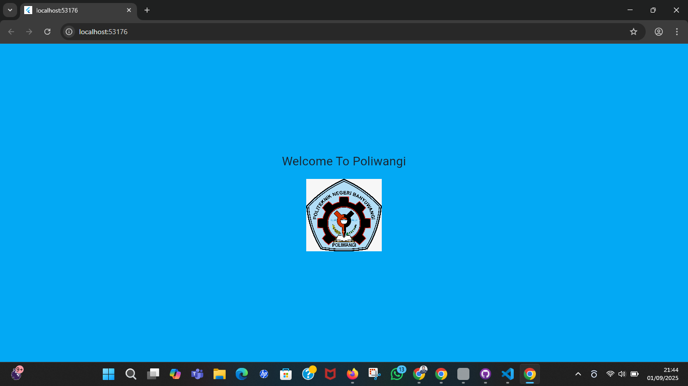

# Praktikum 1

1. Praktikum text widget
2. Praktikum image widget
3. Praktikum kombinasi image dan text

# Tahapan kombinasi images dan text

1. Membuat Text Widget dengan gaya text yang diinginkan
2. Menambahkan Image widget untuk menampilkan gambar dari folder assets
3. Menggabungkan kedua widget (Text dan Image) dalam satu column, kemudian memberi jarak antara keduanya menggunakan SizedBox
4. Panggil widget kombinasi dari file main.dart
5. Atur warna untuk latar belakang nya
